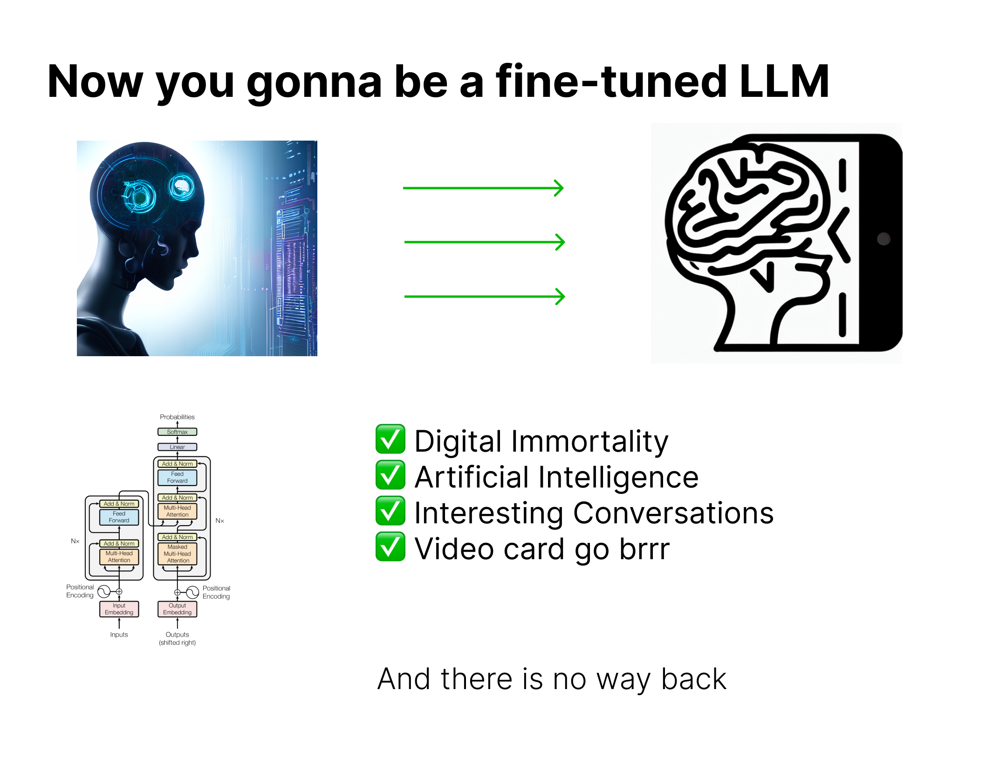

# Textual Avatar 

Welcome to the Textual Avatar project! This repository contains a minimal yet comprehensive code snippet that guides you through the process of creating your own personalized conversational AI using a fine-tuned language model (LLama-2 as of August 2023).

## Project Overview

Have you ever wondered what it would be like to have a chatbot that responds in a way that's uniquely yours? With Textual Avatar, you can achieve just that. This project takes you through the following steps:

1. **Extract Text Data**: Learn how to extract your own text data from various sources.
2. **Conversion and Encryption**: Convert your data into an instruction-based format and ensure your privacy by encrypting it.
3. **Fine-Tune LLM**: Fine-tune the LLama-2 language model using your encrypted data for a personalized touch.
4. **Try the Demos**: Explore the provided inference demos, including a user-friendly Gradio interface and a Telegram bot.

## Getting Started

To get started, simply open the [textual_avatar.ipynb](textual_avatar.ipynb) notebook in this repository. This notebook serves as your guide, providing step-by-step instructions, code snippets, and explanations to help you create your own Textual Avatar.

Got questions or ideas on improvement? Feel free to reach out.
serenkiy@ieee.org
